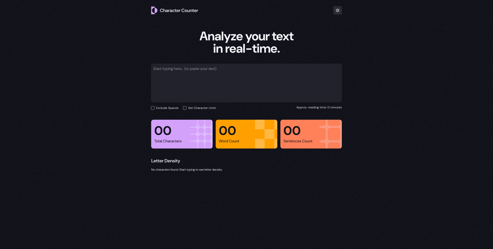

# Frontend Mentor - Character Counter Solution

This is a solution to the [Character Counter challenge](https://www.frontendmentor.io/challenges/character-counter-ekEt-DiSDD) on [Frontend Mentor](https://www.frontendmentor.io).

## Table of contents

- [Overview](#overview)
  - [The challenge](#the-challenge)
  - [Screenshot](#screenshot)
  - [Links](#links)
- [My process](#my-process)
  - [Built with](#built-with)
  - [What I learned](#what-i-learned)
  - [Continued development](#continued-development)
  - [Useful resources](#useful-resources)
  - [AI Collaboration](#ai-collaboration)
- [Acknowledgments](#acknowledgments)

## Overview

### The challenge

Users should be able to:

- [x] Analyze the character, word, and sentence counts for their text
- [x] Exclude/Include spaces in their character count
- [x] Set a character limit
- [x] Receive a warning message if their text exceeds their character limit
- [x] See the approximate reading time of their text
- [x] Analyze the letter density of their text
- [x] Select their color theme
- [x] Navigate the app and perform all actions using only their keyboard
- [x] View the optimal layout for the interface depending on their device's screen size
- [x] See hover and focus states for all interactive elements on the page

### Screenshot



### Links

- Solution URL: https://github.com/Zuzana83/character-counter/
- Live Site URL: https://zuzana83.github.io/character-counter/

## My process

### Built with

- Semantic HTML5 markup
- Vanilla CSS with custom properties, driving nearly all theme-dependent visuals (logo, background pattern, and icon swaps) with zero JavaScript involvement
- Flexbox and CSS Grid
- Mobile-first workflow
- Vanilla JavaScript (no frameworks or libraries)
- Dynamically generated DOM elements (`document.createElement`) for the letter density list, rebuilt from scratch on every recalculation
- Regex for text parsing (word splitting, sentence splitting, letter filtering)

### What I learned

This project was built specifically to reinforce skills from my previous two projects — particularly sequencing logic correctly — while pushing into genuinely new territory: real-time, keystroke-driven recalculation instead of submit-triggered validation, and working with data structures (objects, and transforming them into arrays) I hadn't needed before.

One bug taught me something important about reasoning with booleans. My "See more" button toggles a letter density list between showing 5 letters and showing all of them, using `aria-expanded` as the single source of truth for its state:

```js
const isExpanded = seeMoreBtnEl.getAttribute("aria-expanded") === "true";
```

My first attempt had the text, icon, and rendered list all backwards — correct on paper, but visually one step behind and reversed on every click. The mistake was treating `isExpanded` as if it described what the click should *do*, rather than what state the button was *coming from*. Once I stopped reasoning about the variable name and instead traced the actual attribute's value through each click — starting at `"false"`, becoming `"true"`, back to `"false"` — the correct mapping became obvious: if currently expanded, this click collapses; if currently collapsed, this click expands. A related bug surfaced from this same feature: recalculating the list on every keystroke correctly collapsed it back to the top 5, but nothing reset the button's own text, icon, or `aria-expanded` state, since that logic only lived inside the click handler. The list and the button represented the same reality but could drift out of sync, since only one of them updated on every keystroke. I fixed this by extracting a single `resetSeeMoreBtn()` function, called from both the recalculation path and implicitly relied upon by the click handler, so there's exactly one place that decides what "collapsed" looks like.

The letter density feature introduced a genuinely new pattern for me: moving data through several different shapes before it was ready to render. I first count letters into a plain object, since it's the natural fit for "look up and update a count by key":

```js
if (letterCounts[char] === undefined) {
  letterCounts[char] = 1;
} else {
  letterCounts[char] = letterCounts[char] + 1;
}
```

But objects don't have a `.sort()` method, only arrays do, so the next step is converting that object into an array of `[letter, count]` pairs with `Object.entries()`, which can then be sorted by count. From there, `.map()` transforms each pair into a richer object holding the letter, its count, and its calculated percentage — using array destructuring in the parameter list (`([letter, count]) => ...`) to avoid awkward index-based access like `letter[0]`/`letter[1]`. Seeing the same data deliberately reshaped three times — object, then array of pairs, then array of objects — each time picking whichever shape made the *next* step easiest, was a different way of thinking about a problem than anything in my previous two projects, where I was usually working with one consistent object shape throughout.

The most useful architectural decision was recognizing how much of the theme toggle didn't need JavaScript at all. My first instinct was to swap the logo's `src`, rebuild the button's icon markup, and change the background image, all via JS, mirroring my `<head>` script's job. But a `<head>` script runs before `<body>` elements exist at all, so it can never reference a button, an image, or a textarea directly — only `<html>` itself. Once I restructured the logo, background pattern, and icon as pairs of elements toggled purely through CSS rules scoped to a `lightTheme` class, the `<head>` script's only remaining job was adding that one class — and every visual swap happened automatically and instantly, with no flash of the wrong theme and no JavaScript needing to reach into elements that might not exist yet.

### Continued development

- Revisit whether the character-limit warning's `aria-live` region reliably re-announces when the exact same message text is set twice in a row (e.g., the limit is crossed, un-crossed, then crossed again at the identical value) — a known, minor limitation I deliberately left unaddressed this round, to test properly with a real screen reader like Orca.

### Useful resources

- [MDN Web Docs](https://developer.mozilla.org/) - My first stop for regex syntax, `Object.entries()`, and array methods like `.filter()` and `.sort()` before applying them.
- After reading MDN, I generally search for real-world implementations of the same concept to see the theory applied in an actual project, which usually helps it click faster than the reference documentation alone.

### AI Collaboration

I used AI as a mentor the same way as my previous projects — working through the theory behind a concept first, writing my own draft, testing it directly in the browser or console, and iterating based on what I actually observed rather than being handed a solution outright. This project in particular involved a lot of tracing through buggy state by hand — walking through exact variable values across multiple clicks or keystrokes — which was the most valuable part of the process, since it's the same debugging discipline I'll need on every future project regardless of what I'm building.


## Acknowledgments

Thanks to this AI mentor/guide approach I am able to solve more complex projects, learn new concepts, explore more advanced javascript which I would not be able to do just on my own, without verifying I understand theory and implement it correctly. 